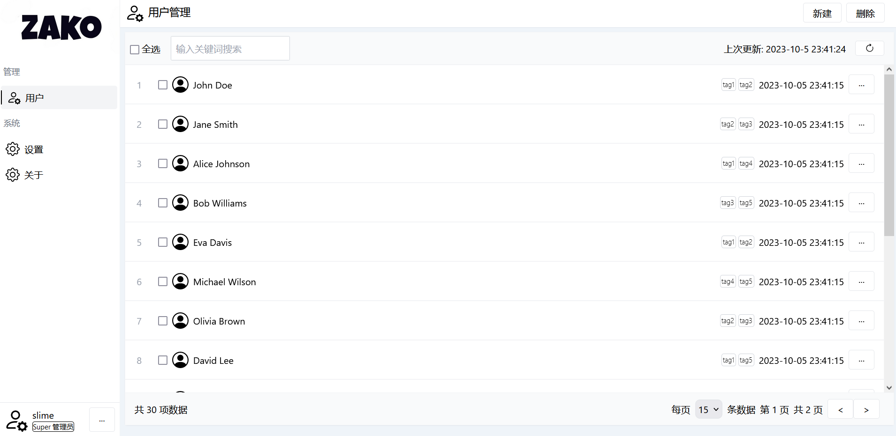
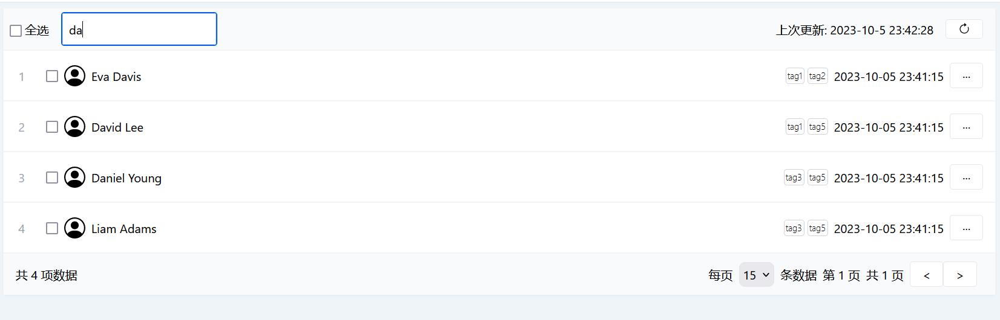
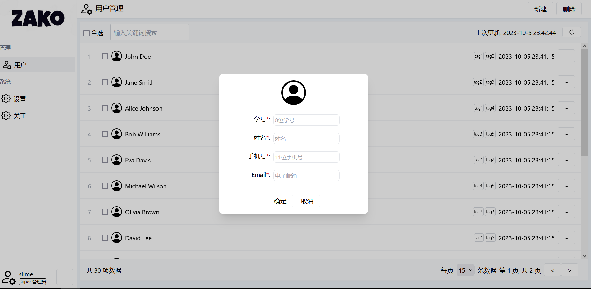
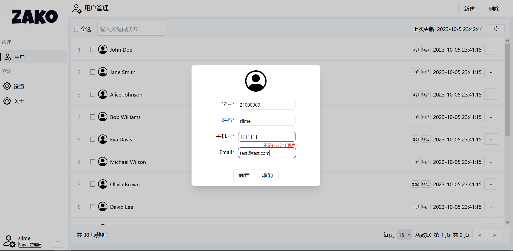

# 用户信息管理

React + tailwindcss + Go

## Features

- 用户信息的增删查
- 根据用户姓名 Fuzzy 查询
- 分页
- 鉴权(fake, localStage)

## Blink



### Fuzzy



### 新建用户





## TODO

- [ ] Toast 提示优化
- [ ] 用户信息、tags 增改

## 结构

- mock: 后端数据
- public: 前端用到的静态资源
- src: 前端页面源码

## 食用方式

在项目根目录执行:

```shell
make site
```