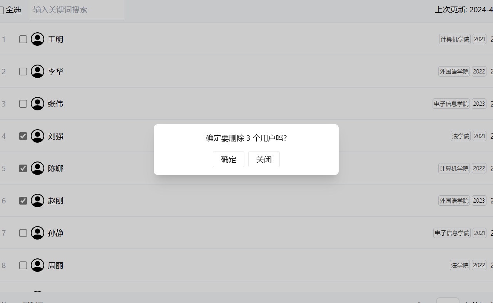

# 用户信息管理

React + tailwindcss + Go

## Features

- 用户信息(包含tags)的 CRUD
- 根据用户姓名、tag的 Fuzzy 查询
- 分页
- 鉴权(fake, localStage)
- Toast 轻提示
- batteries-included(mock data)

## 结构

- mock: 后端数据
- public: 前端用到的静态资源
- src: 前端页面源码

## 食用方式

在项目根目录执行:

```shell
make site
```

Makefile 会在同一个终端同时运行前后端，如需要请分开运行

```makefile
.PHONY: site
site:
	@(cd mock/ && make run) & yarn dev
```

## 预览





